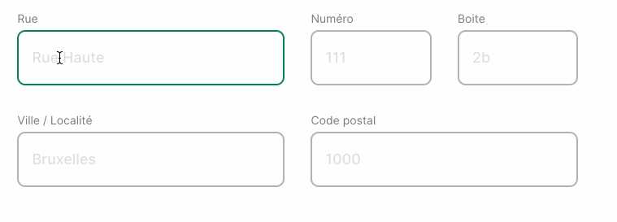

# Googlemaps address autocomplete (Vue.js)

#### Description:
This vue package aims at helping you to seamlessly integrate the auto-complete feature in a vue project.
Google API has developped a nice auto-suggests feature that will help users as they type an address into a form.
This component is build on that Google feature.



### Usage
1. Register on the [Google Maps Platform](https://developers.google.com/maps/documentation/javascript/places-autocomplete) to get an API key from Google.
2. npm install this package
3. In your Vue project, globally or locally register this component. Don't forget to define the `googleApiKey` !
  ```
  // Globally in main.js
  import AddressAutocomplete from 'vue-googlemaps-address-autocomplete';
  Vue.use(AddressAutocomplete);

  Vue.config.globalProperties.googleApiKey = 'yourApiKey';

  // Locally in a component.vue
  import AddressAutocomplete from 'vue-googlemaps-address-autocomplete';
  export default {
    ...,
    components: { addressAutocomplete },
    ...
  };
  ```

4. Component is used as such
  ```
  <template>
    <address-autocomplete
      v-slot="{ addressAutocompleteRef, loadGoogleMapsScript }"
      @udpateAddress="populateAutocompletedAddress"
    >
      <div>
        <input
          v-model="address.streetName"
          :ref="addressAutocompleteRef"
          @input.once="loadGoogleMapsScript"
        >
        <input v-model="address.streetNumber">
        <input v-model="address.streetBox">
        <input v-model="address.zipCode">
        <input v-model="address.city">
      </div>
    </address-autocomplete>
  </template>

  <script>
    export default {
      ...,
      methods: {
        populateAutocompletedAddress (autocompletedAddress) {
          // Here you assign the autocompletedAddress to your address data.
          this.address = { ...this.address, ...autocompletedAddress };
        }
      }
    }
  </script>
  ```